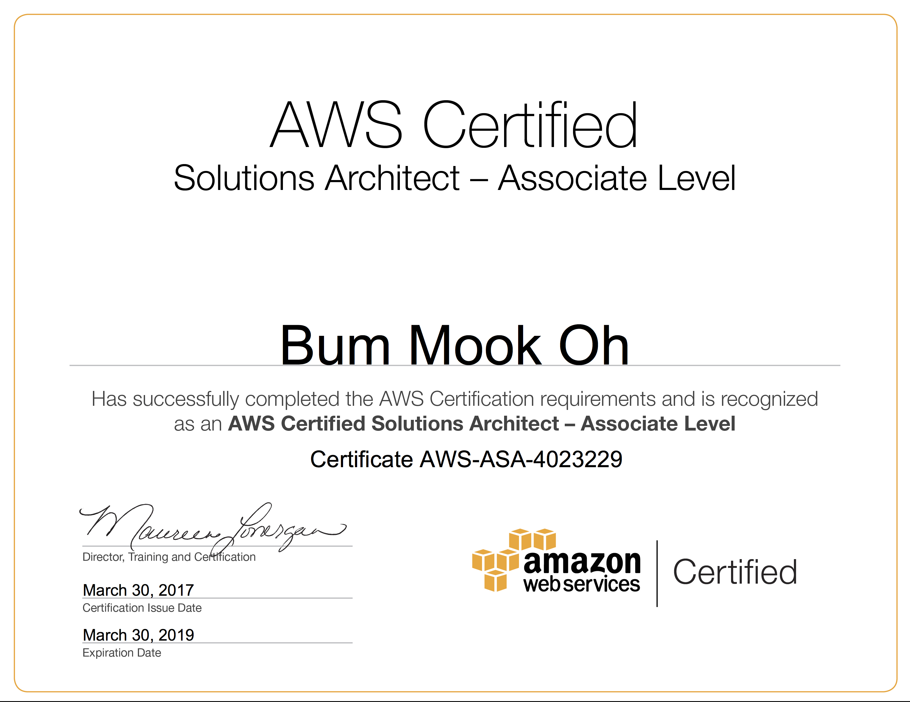

# Road.IO

### Overview
![alt text][poster]

Road.IO is a platform that crowdsources dashcam footage that is then processed and packaged into datasets of images and metadata to be sold to Autonomous Car Companies.
    
Around 400 companies are working to bring their autonomous cars to market right now. However, self-driving cars require huge training datasets of tagged traffic images in a variety of conditions to be properly trained. Despite the high costs of gathering this data, existing and emerging companies are forced to collect the same kinds of information over and over again to protect their competitive advantage. We chose this model  so that our customers have greater flexibility when they train their models and to prevent over fitting. When drivers upload their footage, they help make a worldwide socio-technical impact, and are even paid for their submissions. Currently, we only recognize stop signs.

Our platform addresses these challenges by providing rich, hyper-localized metadata and images. Potentially, this may even turn in to a revenue system where companies can post listings on our site asking uploaders to provide footage of a specific area for a premium.

### Table of Contents

### Summary of the Major Technology Decisions

### Technology Stack and Rationale
  

To prepare for Capstone, two members became AWS Certified as Solutions Architects at the associate level. We understood the benefits of Serverless and how we would be able to leverage the powerful product offerings while minimizing cost. We chose AWS Cognito to store user credentials, DynamoDB for fast querying of unstructured data and EC2 in tandem with SQS to execute Computer Vision Jobs. The libary we used for this was DLib's Simple Object Detector. For the front-end, we employed the usual suspects: HTML5, CSS3, and Javascript because of their reliable frameworks and support.

### Serverless Architecture
 

### Contact Us
Arvindram : [Email](mailto:karvi90@gmail.com), [LinkedIn](https://www.linkedin.com/in/arvindramkrishnamoorthy)

Tanner Garrett : [Email](mailto:tanner@garrett.org)

Bum Mook Oh : [Email](mailto:bmo5@uw.edu), [LinkedIn](https://www.linkedin.com/in/bummookoh/)

Josh Hall : [Email](mailto:jhall38@uw.edu), [LinkedIn](https://www.linkedin.com/in/jhall38/)

[poster]: src/roadio_capstone_poster.png "Road.IO Poster"
[aws_arvind]: src/aws_arvind.png "Arvind AWS Certificate"
[aws_chris]: src/aws_chris.png "Chris AWS Certificate"
[serverless]: src/serverless.jpg "Serverless"
